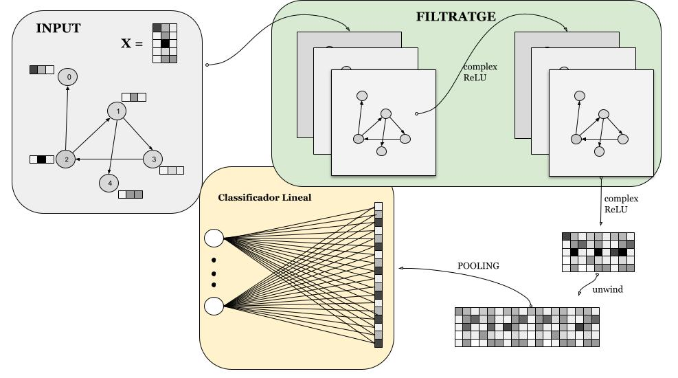

# MagNet for Graph Clasification

This repository is design of a Graph Neural Network for the classification of graphs. This GNN is aimed to work with directed graphs, but also works with undirected graphs. 
In order to design this GNN, we used the Magnetic Laplacian since in node-levels and edge-level performed well, see [MAGNET](https://arxiv.org/pdf/2102.11391) for more detailed 
information. We used a similar idea, but changing the readout. 

## Spectral Filtering on Directed Graphs

Spectral Filtering is a technique developed on Graph Signal Processing, [GSP](https://www.sciencedirect.com/science/article/pii/S1063520310000552), to extract important information of signals over graphs (a function $f:V\rightarrow~\mathbb{R}$). To extend this concept on directed graphs we used the Magnetic Laplacian, wich has complex weights on a simetric graph that preserve the information of the direction. The MagNet uses several layers of this spectral filtering and a simple readout layer to work on a graph level task. We obtain better results than using simple convolution layers. Nevertherless it's important to improve the global architecture and the readout layers to extract more information on a graph level task.

Yo can see more information on my final bachelor's project  [TFG](https://www.linkedin.com/feed/update/urn:li:activity:7357046887759114240/).

## Architecture scheme

# References

-  MagNet: [arXiv document](https://arxiv.org/pdf/2102.11391)
-  Code: [gitHub repository](https://github.com/qbxlvnf11/graph-neural-networks-for-graph-classification)
