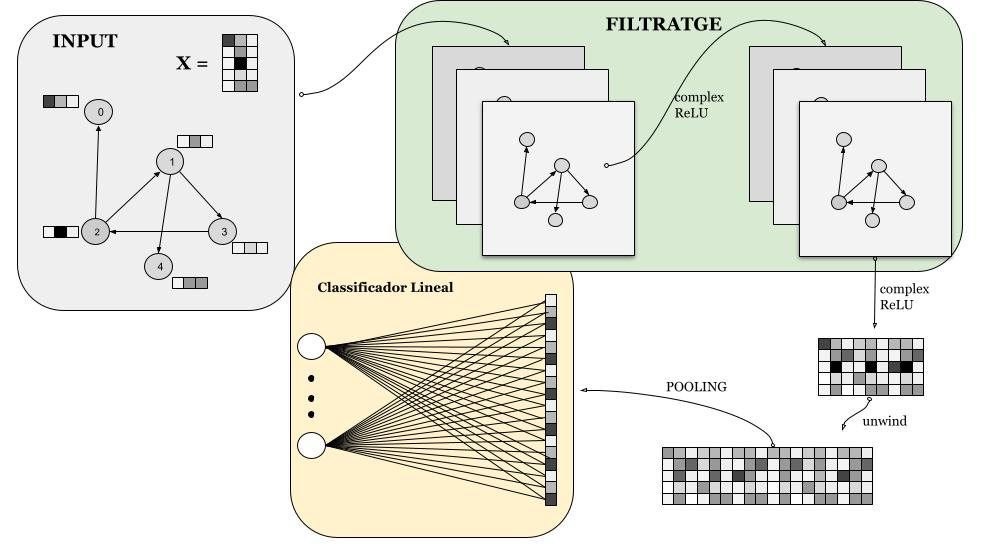

# MagNet for Graph Classification

Graph classification framework using **Magnetic Graph Neural Networks (MagNet)** applied to biological metabolic network data. The model exploits directional structure in reaction graphs and metabolic DAGs of organisms to classify them into taxonomic kingdoms.

Spectral filtering is a technique from Graph Signal Processing ([GSP](https://www.sciencedirect.com/science/article/pii/S1063520310000552)) that extracts information from signals over graphs. To extend it to directed graphs, we use the **Magnetic Laplacian**, which encodes edge direction as a complex phase factor on a symmetrised adjacency matrix. We adapt the node/edge-level [MagNet](https://arxiv.org/pdf/2102.11391) architecture for **graph-level classification** by adding a readout layer.

More information and results in the bachelor's thesis [TFG](https://www.linkedin.com/feed/update/urn:li:activity:7357046887759114240/).



---

## Table of Contents

1. [Repository Structure](#1-repository-structure)
2. [Data Pipeline](#2-data-pipeline)
   - [2.1 Raw Data Preprocessing](#21-raw-data-preprocessing)
   - [2.2 Dataset Loading](#22-dataset-loading)
3. [The Magnetic Laplacian](#3-the-magnetic-laplacian)
4. [Layer Design](#4-layer-design)
5. [Models](#5-models)
6. [Readout Functions](#6-readout-functions)
7. [Training](#7-training)
8. [Results](#8-results)
9. [How to Run](#9-how-to-run)
10. [References](#10-references)

---

## 1. Repository Structure

```
MagNet-graph-clasif/
│
├── datasets/
│   ├── Euk_Prok.py            # Raw data preprocessor → TU-format files
│   ├── graph_data_reader.py   # DataReader + GraphData (PyTorch Dataset)
│   ├── nodea_features.py      # Node feature utilities
│   ├── process_king_data.py   # Additional data processing
│   └── RGRAPH/ MDAG/ MDAG_LC/ # Generated TU-format dataset folders
│
├── layers/
│   ├── graph_cheb.py          # MagNet layer (pre-computed Laplacian as input)
│   └── magnetic_chebs.py      # MagNet layer (multi-frequency, computes L internally)
│
├── models/
│   ├── MAGNET.py              # MagNet model — uses graph_cheb layer
│   ├── magnet_2.py            # MagNet model — uses magnetic_chebs layer
│   └── GCN.py                 # Standard GCN baseline
│
├── readouts/
│   └── basic_readout.py       # Graph-level pooling (max / avg / sum, complex variants)
│
├── Weisfeirel-Lehman/         # WL kernel baseline experiments
│
├── train2.py                  # Main training script (CLI)
├── utils.py                   # Helper utilities
└── test_result/               # Saved cross-validation results
```

---

## 2. Data Pipeline

### 2.1 Raw Data Preprocessing

**File:** [datasets/Euk_Prok.py](datasets/Euk_Prok.py)

Converts raw organism CSV data into the **TU graph dataset format** used by the DataReader.

**Classification task:** Given the metabolic graph of an organism, predict its kingdom:

| Label | Kingdom  |
|-------|----------|
| 0     | Animals  |
| 1     | Archaea  |
| 2     | Fungi    |
| 3     | Plants   |
| 4     | Protists |

> Bacteria are excluded (`None` label) and skipped during dataset construction.

#### `modify_results()`

Reads `Results.csv` for both `Prok/` and `Euk/` organism directories. Normalises the `Categories` column to canonical kingdom names by substring matching, then writes `Results2.csv`.

#### `process_raw2(mdag=False, largest_component=False)`

Iterates over all organisms and builds four TU-format text files in `datasets/{NAME}/`:

| File                         | Content                                           |
|------------------------------|---------------------------------------------------|
| `{NAME}_A.txt`               | Edge list — one `src, dst` pair per line          |
| `{NAME}_graph_indicator.txt` | Graph ID for each node (one entry per node)       |
| `{NAME}_graph_labels.txt`    | Integer label per graph                           |
| `{NAME}_node_labels.txt`     | Node label (fixed to `1` — uniform features)      |

Parameters:

| Parameter           | Effect                                                      |
|---------------------|-------------------------------------------------------------|
| `mdag=False`        | Reads `*_R_adj.csv` (reaction graphs) → dataset `RGRAPH`   |
| `mdag=True`         | Reads `*_mDAG_adj.csv` → dataset `MDAG`                    |
| `largest_component=True` | Reads `*_mDAG_biggerDAG_adj.csv` → dataset `MDAG_LC` |

---

### 2.2 Dataset Loading

**File:** [datasets/graph_data_reader.py](datasets/graph_data_reader.py)

#### `DataReader(data_dir, rnd_state, folds=10)`

Loads a TU-format folder and builds a data dictionary:

| Key              | Description                                             |
|------------------|---------------------------------------------------------|
| `adj_list`       | List of per-graph adjacency matrices (`np.ndarray`)     |
| `features`       | Per-graph node feature matrices (defaults to node degree if no label file) |
| `targets`        | Graph-level integer labels (0-indexed)                  |
| `splits`         | K-fold train/test index splits                          |
| `N_nodes_max`    | Maximum node count (used for zero-padding)              |
| `features_dim`   | Node feature dimensionality                             |
| `n_classes`      | Number of distinct classes                              |

#### `GraphData(fold_id, datareader, split)`

A `torch.utils.data.Dataset` for one fold. Each item is a list of tensors zero-padded to `N_nodes_max`:

| Index | Tensor          | Shape                            | Description                    |
|-------|-----------------|----------------------------------|--------------------------------|
| 0     | `x_real`        | `(N_nodes_max, features_dim)`    | Real part of node features     |
| 1     | `x_imag`        | `(N_nodes_max, features_dim)`    | Imaginary part of node features|
| 2     | `L_real` / adj  | `(N_nodes_max, N_nodes_max)`     | Real part of Laplacian (or raw adj) |
| 3     | `L_imag`        | `(N_nodes_max, N_nodes_max)`     | Imaginary part of Laplacian    |
| 4     | `graph_support` | `(N_nodes_max,)`                 | Mask: 1 for real nodes, 0 for padding |
| 5     | `N_nodes`       | scalar                           | True number of nodes           |
| 6     | `label`         | scalar                           | Graph class label              |

**`ad2MagLapl(q)`** — Call this on `GraphData` before creating the DataLoader when using MAGNET. Converts each adjacency matrix in-place to the real and imaginary parts of the Magnetic Laplacian.

---

## 3. The Magnetic Laplacian

For a directed graph with adjacency matrix **A**, the **normalised Magnetic Laplacian** at frequency `q` is:

```
L^(q) = I  −  D_s^{-1/2}  A_s  D_s^{-1/2}  ⊙  Θ^(q)
```

where:
- `A_s = 0.5 * (A + Aᵀ)` — symmetrised adjacency
- `D_s` — degree matrix of `A_s`
- `Θ^(q)_{ij} = cos(2π q (A_{ij} − A_{ji})) + i · sin(2π q (A_{ij} − A_{ji}))` — complex phase encoding edge direction
- `⊙` — Hadamard (element-wise) product

Since `L^(q)` is Hermitian, it decomposes into real (`L_real`) and imaginary (`L_imag`) parts that are processed separately. The frequency `q` controls the sensitivity to directionality: `q = 0` recovers the standard symmetric normalised Laplacian.

---

## 4. Layer Design

### `layers/graph_cheb.py` — MagNet Layer (pre-computed Laplacian)

**File:** [layers/graph_cheb.py](layers/graph_cheb.py)

```
MagNet_layer(in_features, out_features, device, bias=True, K=1, simetric=True, q=0.25)
```

Takes pre-computed `(L_real, L_imag)` tensors as inputs (batched, shape `(B, N, N)`).

**Symmetric mode (`K=1, simetric=True`)** — single weight matrix `W ∈ ℝ^{in × out}`:

```
H = I − L^(q)     (the Hermitian filter)

out_real = H_real · X_real·W  −  H_imag · X_imag·W
out_imag = H_imag · X_real·W  +  H_real · X_imag·W
```

**General Chebyshev mode (`K > 1`)** — weight tensor `W ∈ ℝ^{(K+1) × in × out}` with Chebyshev polynomial expansion:

```
T_0 = I,   T_1 = I − L^(q)
T_k = 2 · L^(q) · T_{k-1}  −  T_{k-2}

out = Σ_{k=0}^{K}  T_k · X · W_k
```

(All products above are complex matrix multiplications split into real/imaginary parts.)

---

### `layers/magnetic_chebs.py` — Multi-frequency MagNet Layer

**File:** [layers/magnetic_chebs.py](layers/magnetic_chebs.py)

```
MagNet_layer(in_features, out_features, device, bias=True, K=1, frequencies=[])
```

Computes the Magnetic Laplacian **internally** during the forward pass. Each output feature channel `idx` has its own frequency `q = 1 / frequencies[idx]` and weight vector `W[idx] ∈ ℝ^{(K+1) × in}`. This allows a single layer to learn from **multiple spectral frequencies simultaneously**.

> Receives raw adjacency matrices (not pre-computed Laplacians) and calls `ad2MagL` on each graph in the batch.

---

### `complex_relu_layer`

Applies ReLU to complex-valued node features using the real part as a gate:

```
mask = 1[ Re(x) ≥ 0 ]
CReLU(x) = ( mask · Re(x),  mask · Im(x) )
```

This zeroes out features with a negative real component while preserving the complex structure of the remaining features.

---

## 5. Models

### `models/MAGNET.py`

**File:** [models/MAGNET.py](models/MAGNET.py)

```
MagNet(n_feat, n_class, n_layer, agg_hidden, dropout, readout, device, order=1, simetric=True)
```

Uses `graph_cheb.MagNet_layer`. The Magnetic Laplacian must be pre-computed externally via `gdata.ad2MagLapl(q=...)`.

**Architecture:**

```
Input: (x_real, x_imag, L_real, L_imag)
        ↓
[MagNet_layer(n_feat → agg_hidden)]  → CReLU
[MagNet_layer(agg_hidden → agg_hidden)] × (n_layer − 1)  → CReLU
        ↓
Readout  →  (B, 2·agg_hidden)
        ↓
Linear(2·agg_hidden → agg_hidden)  → ReLU
Linear(agg_hidden → n_class)       → Softmax
```

---

### `models/magnet_2.py`

**File:** [models/magnet_2.py](models/magnet_2.py)

```
MagNet2(n_feat, n_class, n_layer, agg_hidden, dropout, readout, device,
        order=1, freq=[[...], [...]], simetric=True)
```

Uses `magnetic_chebs.MagNet_layer`. Computes Laplacians internally; receives raw adjacency from `data[2]`. Each layer has its own frequency list (one frequency per output channel).

---

### `models/GCN.py`

Standard Graph Convolutional Network — undirected, no Magnetic Laplacian. Used as baseline.

---

## 6. Readout Functions

**File:** [readouts/basic_readout.py](readouts/basic_readout.py)

Collapses node dimension `(B, N, F) → (B, F)` for graph-level prediction.

| Name          | Operation                                    |
|---------------|----------------------------------------------|
| `max`         | Max pooling over nodes (real signals)        |
| `avg`         | Average pooling over nodes (real signals)    |
| `sum`         | Sum pooling over nodes (real signals)        |
| `complex_max` | Max pooling over `[Re ‖ Im]` concatenated    |
| `complex_avg` | Average pooling over `[Re ‖ Im]` concatenated|
| `complex_sum` | Sum pooling over `[Re ‖ Im]` concatenated    |

For complex readouts, `unwind` concatenates real and imaginary parts along the feature axis before pooling, producing output of size `2·F`.

---

## 7. Training

**File:** [train2.py](train2.py)

K-fold cross-validation training loop. All hyperparameters are passed via CLI.

### Key Arguments

| Argument          | Default | Description                                                   |
|-------------------|---------|---------------------------------------------------------------|
| `--model_list`    | —       | `GCN`, `MAGNET`, `magnet_2`, or `ALL`                         |
| `--dataset_list`  | —       | `PROTEINS`, `RGRAPH`, `MDAG`, `MDAG_LC`, or `ALL`             |
| `--readout_list`  | —       | Any readout from §6, or `ALL`                                 |
| `--n_folds`       | 10      | Number of cross-validation folds                              |
| `--epochs`        | 50      | Training epochs per fold                                      |
| `--batch_size`    | 32      | Mini-batch size                                               |
| `--learning_rate` | 0.001   | Adam learning rate                                            |
| `--weight_decay`  | 5e-4    | L2 regularisation coefficient                                 |
| `--n_agg_layer`   | 2       | Number of graph convolution layers                            |
| `--agg_hidden`    | 64      | Hidden dimension of graph layers                              |
| `--order`         | 1       | Chebyshev polynomial order `K`                                |
| `--mag_q`         | 0.25    | Magnetic Laplacian frequency `q` (MAGNET only)                |
| `--cuda`          | TRUE    | Use GPU if available                                          |
| `--save_model`    | TRUE    | Save model weights after each fold                            |

### Optimiser

- **Adam** with betas `(0.5, 0.999)`
- **MultiStepLR** scheduler: ×0.1 at epochs 20 and 30
- **Loss:** cross-entropy (`F.cross_entropy`)

### Output Files

```
RESULTS/{dataset}/{model}/fold_{k}/results_acc.csv   # Per-epoch accuracy per fold
RESULTS/{dataset}/results_acc.csv                    # Summary across all folds & readouts
test_result/{model}/{model}_{layers}_h{hidden}_10_cross_validation.csv
save_model/{model}/*.pt                              # Saved weights (if --save_model TRUE)
```

---
## 8. How to Run

### Step 1 — Preprocess raw organism data

Edit the last two lines of `datasets/Euk_Prok.py` to select dataset type, then run:

```bash
python datasets/Euk_Prok.py
```

This generates `datasets/MDAG_LC/` (or `RGRAPH/` / `MDAG/`).

### Step 2 — Train

```bash
# MAGNET on MDAG_LC with complex average readout
python train2.py \
  --model_list MAGNET \
  --dataset_list MDAG_LC \
  --readout_list complex_avg \
  --epochs 50 \
  --n_agg_layer 2 \
  --agg_hidden 64 \
  --order 1 \
  --mag_q 0.25 \
  --cuda TRUE
```

```bash
# All models on all datasets
python train2.py \
  --model_list ALL \
  --dataset_list ALL \
  --readout_list complex_avg \
  --epochs 50
```

### Step 3 — Inspect results

```
RESULTS/
└── MDAG_LC/
    └── MAGNET/
        ├── fold_0/results_acc.csv
        └── ...
    └── results_acc.csv

test_result/MAGNET/MAGNET_2_h64_10_cross_validation.csv
```

---

## 9. References

- MagNet paper: [arXiv:2102.11391](https://arxiv.org/pdf/2102.11391)
- Base GNN code: [graph-neural-networks-for-graph-classification](https://github.com/qbxlvnf11/graph-neural-networks-for-graph-classification)
- Graph Signal Processing: [Shuman et al., 2013](https://www.sciencedirect.com/science/article/pii/S1063520310000552)
